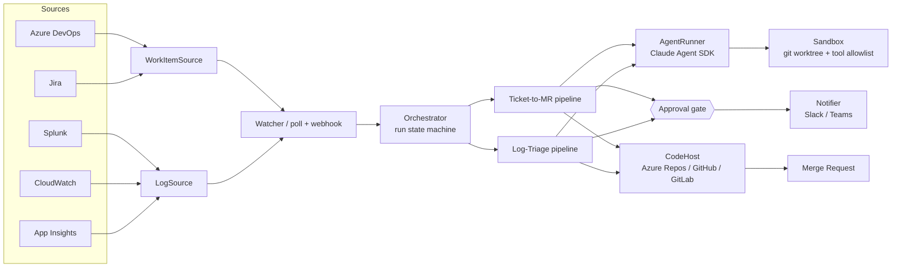

# engineering-agents

> A blueprint — and a runnable scaffold — for agents that take over the repetitive half of an engineer's day.

Two agents, one platform:

| Agent | Trigger | Does | Ends with |
|---|---|---|---|
| **Ticket-to-MR** | A new/updated story, bug, or task in Azure DevOps / Jira | Requirement analysis → clarifying questions → implementation plan → **human approval gate** → code → tests → self-review | A merge request linked back to the work item |
| **Log-Triage** | An error cluster, anomaly, or SLO burn in Splunk / CloudWatch Logs / Application Insights | Signal dedup → evidence gathering → root-cause analysis → **human approval gate** → fix → regression test | A merge request linked back to the incident |

Everything provider-specific sits behind four interfaces (`WorkItemSource`, `LogSource`, `CodeHost`, `Notifier`), so "any configurable tool" is a config change, not a rewrite.

---

## Why this shape

Most "AI does your ticket" demos fail on the same three things. This design is built around them:

1. **The model is not the hard part — the context is.** An agent that reads only the ticket title writes plausible nonsense. Both agents spend most of their budget on *retrieval*: linked tickets, past MRs touching the same files, the service's runbook, the actual log events, the code conventions in the repo.
2. **Autonomy without a gate is a liability.** Both pipelines stop at a plan and wait for a human. Approval is the product. Implementation only starts from an approved plan, and the diff is the *proposal*, never the merge.
3. **Trust is earned per-capability, not all at once.** The rollout ladder (`docs/08-rollout.md`) starts the agents in comment-only mode and promotes them one rung at a time based on measured acceptance rate.

## Architecture at a glance



Full component breakdown: [docs/01-architecture.md](docs/01-architecture.md).

## Documentation

| Doc | What's in it |
|---|---|
| [00-overview.md](docs/00-overview.md) | The problem, the scope boundaries, what these agents deliberately do *not* do |
| [01-architecture.md](docs/01-architecture.md) | Components, run state machine, storage, event flow, failure handling |
| [02-agent-ticket-to-mr.md](docs/02-agent-ticket-to-mr.md) | Stage-by-stage spec: triage → analysis → plan → approval → implement → verify → publish |
| [03-agent-log-triage.md](docs/03-agent-log-triage.md) | Signal detection, fingerprinting, evidence bundles, RCA, fix classification |
| [04-connectors.md](docs/04-connectors.md) | The four interfaces + field mappings for ADO, Jira, Splunk, CloudWatch, App Insights, Azure Repos, GitHub, GitLab |
| [05-guardrails.md](docs/05-guardrails.md) | Blast radius, tool allowlists, secrets, sandboxing, prompt-injection defence |
| [06-human-in-the-loop.md](docs/06-human-in-the-loop.md) | Approval protocol, notification payloads, escalation, feedback capture |
| [07-evaluation.md](docs/07-evaluation.md) | Metrics that matter, golden sets, shadow mode, offline replay |
| [08-rollout.md](docs/08-rollout.md) | The five-rung autonomy ladder and the exit criteria for each rung |
| [09-operations.md](docs/09-operations.md) | Cost model, observability, on-call runbook, kill switch |
| [adr/](docs/adr/) | Architecture decision records with the trade-offs written down |

## Quickstart

```bash
git clone https://github.com/gsaini/engineering-agents.git
cd engineering-agents
npm install
cp config/config.example.yaml config/config.yaml   # then edit
cp .env.example .env                                # then fill in tokens

npm test            # 69 tests, no credentials needed
npm run typecheck
```

**Try it with no credentials at all.** `--dry-run` swaps in in-memory connectors,
a no-op sandbox, and a deterministic agent, so the full pipeline runs on a laptop
with no tracker, no repo access, and no token spend:

```bash
# Ticket-to-MR: triage -> analyse -> plan, then park at the approval gate
npm run dev -- run --work-item DEMO-1 --dry-run

# Approve it: implement -> verify -> publish
npm run dev -- approve <runId> --dry-run

# Log-Triage: detect -> evidence -> root cause -> fix proposal
npm run dev -- run --signal 7e79a800 --dry-run

npm run dev -- status
npm run dev -- show <runId>     # the complete run record
```

A completed dry run walks the real state machine and writes the real record:

```
TRIAGING → ANALYZING → PLANNING → AWAITING_APPROVAL
        → IMPLEMENTING → VERIFYING → PUBLISHING → COMPLETED

artefacts: triage, analysis, plan, approval, implementation, selfReview, mergeRequestUrl
```

With real credentials:

```bash
npm run dev -- validate    # config + connector health, touches nothing
npm run dev -- watch       # poll all enabled sources
```

Swap `DryRunAgentRunner` for `ClaudeCodeAgentRunner` (Claude Agent SDK,
`claude-opus-5`) by dropping `--dry-run` — that is the only difference.

## Configuration

One YAML file drives everything. `${VAR}` is interpolated from the environment, so no secret lands in git.

```yaml
agents:
  ticketToMr:
    enabled: true
    autonomy: propose            # observe | comment | propose | autonomous
    sources: [ado-main]
  logTriage:
    enabled: true
    autonomy: comment
    sources: [appinsights-prod]

workItemSources:
  - id: ado-main
    provider: azure-devops
    options:
      organization: contoso
      project: Payments
      areaPath: "Payments\\Core"
      wiql: "[System.Tags] CONTAINS 'agent-ready'"
      token: ${AZURE_DEVOPS_PAT}

logSources:
  - id: appinsights-prod
    provider: app-insights
    options:
      appId: ${APPINSIGHTS_APP_ID}
      apiKey: ${APPINSIGHTS_API_KEY}
      kql: |
        exceptions
        | where timestamp > ago(15m)
        | summarize count() by problemId, cloud_RoleName
        | where count_ > 25
```

Full reference: [config/config.example.yaml](config/config.example.yaml) and the Zod schema in [src/config/schema.ts](src/config/schema.ts).

## Repository layout

```
docs/          Design docs and ADRs — the "approach" this repo is really about
prompts/       Versioned prompt templates, one per pipeline stage
config/        Example config + JSON schema
src/
  config/      Zod schema, loader, env interpolation
  core/        Types, run state machine, run store, logging
  connectors/  work-items | logs | scm | notify  (interface + providers)
  agent/       AgentRunner abstraction, Claude Agent SDK impl, dry-run impl
  agents/      The two pipelines, stage by stage
  runtime/     Watcher, orchestrator, sandbox, approvals, budget
tests/         Pipeline tests that run without credentials
```

## Status

**Design-complete, scaffold-runnable.** Typecheck is clean, 69 tests pass with no
credentials, and both pipelines execute end to end under `--dry-run`.

What is real: the run state machine and event-sourced record, the connector
interfaces and their normalisation, the guardrail enforcement (path escapes,
command allowlisting, secret scanning, blast radius, sensitive-path routing), the
approval flow, budget enforcement, the prompts, and the CLI.

What is the last mile: the provider connectors carry the correct endpoints,
auth, queries, and field mappings — documented in
[docs/04-connectors.md](docs/04-connectors.md) and unit-tested against captured
payloads — but have not been run against a live tenant. That is deliberate: it is
the part that depends on your organisation, your auth model, and your queries.

See [CONTRIBUTING.md](CONTRIBUTING.md) for how to add a provider.

## License

MIT
