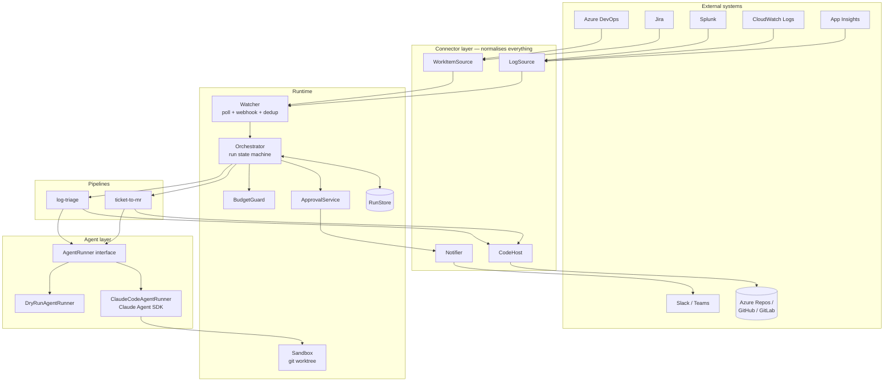
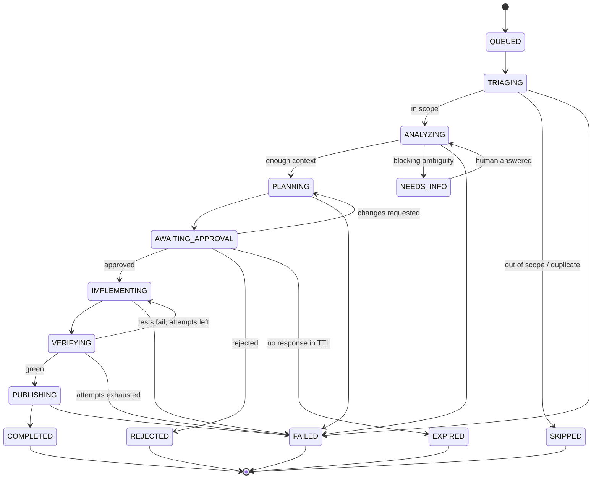

# 01 — Architecture

## Component map



## The seven components

### 1. Connectors

Four interfaces, defined in [`src/connectors`](../src/connectors). Each provider implements exactly one and normalises into a shared domain type. Full contracts and provider field mappings: [04-connectors.md](04-connectors.md).

| Interface | Normalised type | Providers |
|---|---|---|
| `WorkItemSource` | `WorkItem` | `azure-devops`, `jira`, `memory` (tests) |
| `LogSource` | `LogSignal` | `splunk`, `cloudwatch`, `app-insights`, `memory` |
| `CodeHost` | `MergeRequest` | `azure-repos`, `github`, `gitlab` |
| `Notifier` | — | `slack`, `teams`, `console` |

The pipelines import only the interfaces. Adding Linear or Datadog means writing one file and adding one config entry.

### 2. Watcher

Turns "the outside world changed" into a deduplicated stream of triggers.

- **Polling** is the default and the only mode that works everywhere. Each source keeps a high-water mark (`lastSeenAt` / continuation token) in the run store.
- **Webhooks** are an optimisation, not a requirement. Where a provider supports them (ADO service hooks, Jira webhooks) the watcher accepts the payload, then *re-reads the item from the API* rather than trusting the payload — webhooks are lossy, replayed, and out of order.
- **Deduplication** is by *idempotency key*, not by event id:
  - Work items: `sha256(sourceId + workItemId + rev)` — a ticket edited three times produces three keys, but a re-poll of the same revision produces one.
  - Log signals: `sha256(sourceId + fingerprint + windowBucket)` — the same exception cluster inside the same time bucket collapses to one run.
- **Suppression** is a first-class feature. A signal with an open run, an open MR, or a `snoozed-until` marker does not create a new run. Without this, a log-triage agent opens forty MRs for one outage.

### 3. Orchestrator + run state machine

Every unit of work is a `Run` moving through explicit states. This is the backbone: it makes runs resumable after a crash, auditable after the fact, and interruptible by a human at any point.



Rules the orchestrator enforces:

- **Transitions are append-only.** Each writes a `RunEvent` with timestamp, actor (`agent` / `user:<id>` / `system`), and payload. The run's current state is a fold over its events.
- **`AWAITING_APPROVAL` is durable.** The process can restart; the run is picked up again when the approval arrives. Approvals are never held in memory.
- **Only `AWAITING_APPROVAL → IMPLEMENTING` is human-gated** in `propose` mode. In `autonomous` mode that edge auto-fires — but the state still exists in the record, attributed to `system:auto-approve`, so the audit trail is identical in shape.
- **Retries are bounded and stage-scoped.** `VERIFYING → IMPLEMENTING` has a configured max (default 3). Everything else fails fast; agents that retry indefinitely burn money and produce worse output each round.

### 4. RunStore

An append-only event log plus a materialised current-state view.

The reference implementation ([`src/core/store.ts`](../src/core/store.ts)) writes JSONL under `.runs/<runId>/events.jsonl` with a `state.json` snapshot — dependency-free, greppable, and good enough for a single-node deployment. The interface is deliberately narrow (`append`, `load`, `list`, `findByIdempotencyKey`) so swapping in Postgres or DynamoDB is a single file.

What a run record contains:

```
run/
  meta          runId, agent, trigger, repo, autonomy level, created/updated
  trigger       the raw WorkItem or LogSignal, verbatim
  evidence      the retrieval bundle (files read, related MRs, log samples, queries run)
  analysis      restated requirement, assumptions, open questions, risk assessment
  plan          steps, files to touch, test strategy, rollback, estimated blast radius
  approval      decision, actor, timestamp, comments, edits to the plan
  execution     branch, commits, diff stat, test output, tool-call log
  publication   MR url, linked work item, reviewers requested
  cost          tokens in/out, USD, wall time per stage
```

### 5. Sandbox

Agent execution is confined to a **git worktree** cut from a fresh clone at the target base branch:

- One worktree per run under `.worktrees/<runId>`, removed on terminal state.
- Parallel runs never collide, and a run that corrupts its tree cannot affect another.
- The agent's `cwd` is the worktree; `additionalDirectories` is empty by default.
- Tool access is allowlisted (`Read`, `Grep`, `Glob`, `Edit`, `Write`, plus `Bash` restricted to the repo's declared build/test commands). `canUseTool` in the Claude Agent SDK is the enforcement point, and every denial is recorded on the run.
- Network egress from test runs is denied by default; the SDK's `sandbox` setting plus an explicit deny hook covers the common escapes (`curl`, `npm publish`, `git push` to anything but the run's own branch).

Details and the threat model: [05-guardrails.md](05-guardrails.md).

### 6. AgentRunner

A single interface between pipelines and the model, so pipelines are testable without tokens:

```ts
interface AgentRunner {
  run(spec: AgentRunSpec): Promise<AgentRunResult>;
}
```

Two implementations ship:

- **`ClaudeCodeAgentRunner`** — wraps `query()` from `@anthropic-ai/claude-agent-sdk` on `claude-opus-5`. It gets file tools, grep, and constrained bash, which is what makes "read the repo, then change it" work at all. Per-run budgets map to `maxBudgetUsd`; tool policy maps to `canUseTool` and `allowedTools`; structured stage outputs are validated with Zod and one repair round is allowed before the stage fails.
- **`DryRunAgentRunner`** — deterministic canned outputs. Every pipeline test in this repo runs against it, and `--dry-run` lets you exercise the whole flow with zero credentials.

Why the full agent harness rather than plain Messages API calls: the implementation stage is genuinely open-ended file work — read, search, edit, run tests, read the failure, edit again. Rebuilding that loop is the classic mistake. The *analysis* and *planning* stages, by contrast, are structured single-shot calls and could run on the Messages API directly; they use the same runner for uniformity, with tools restricted to read-only.

### 7. Pipelines

Each agent is an ordered list of stages sharing a `RunContext`. Stages are pure-ish functions: read context, do work, append events, return the next state. That makes each independently testable and independently retryable.

```ts
type Stage<T> = (ctx: RunContext) => Promise<StageResult<T>>;
```

Ticket-to-MR: `triage → analyze → plan → [approval] → implement → verify → publish`
Log-Triage: `dedupe → gatherEvidence → rootCause → proposeFix → [approval] → implement → verify → publish`

The last three stages are shared code. Once there is an approved plan naming a repo and a set of files, "make the change and open an MR" is identical work regardless of what triggered it.

## Deployment topologies

| Topology | When | Notes |
|---|---|---|
| **Single long-running service** | Default | One process runs the watcher and orchestrator; runs execute in-process with a concurrency cap. Simplest to operate, fine to a few hundred runs/day. |
| **Scheduled job** | Low volume, cost-sensitive | `eng-agents watch --once` on a cron every 5–15 min. No always-on cost; latency equals the poll interval. |
| **Queue + workers** | High volume / multi-team | Watcher publishes triggers to a queue; workers claim runs. Requires the RunStore behind a real database, and a lease on each run to prevent double-execution. |
| **CI-hosted** | Repos where cloning is expensive | The watcher dispatches a pipeline job in the repo's own CI; the agent runs where the toolchain already exists. Trades latency for zero build-environment drift. |

The reference scaffold implements the first two. The interfaces (`RunStore`, `Orchestrator`) are drawn so the third does not require reshaping the pipelines.

## Failure handling

| Failure | Behaviour |
|---|---|
| Connector API 5xx / rate limit | Exponential backoff with jitter, capped; the watcher's high-water mark is not advanced, so nothing is lost. |
| Model call fails mid-stage | Stage retried once; a second failure moves the run to `FAILED` with the error on the record and a notification. |
| Tests fail during `VERIFYING` | Feed the failure output back to the implement stage, up to `maxFixAttempts`. Then `FAILED` — with the branch and diff preserved so a human can pick it up. |
| Process crash | Runs in non-terminal states are resumed from their event log on startup. Worktrees are reconciled: orphans older than the TTL are deleted. |
| Approval never arrives | `EXPIRED` after `approvalTtl` (default 72h), with a reminder at 50% of TTL. The branch is deleted; the analysis is left as a ticket comment so the work isn't lost. |
| Budget exceeded | `BudgetGuard` stops the run at the current stage boundary, marks it `FAILED` with reason `budget_exceeded`, and notifies. Per-run, per-day, and per-agent caps are all enforced. |
