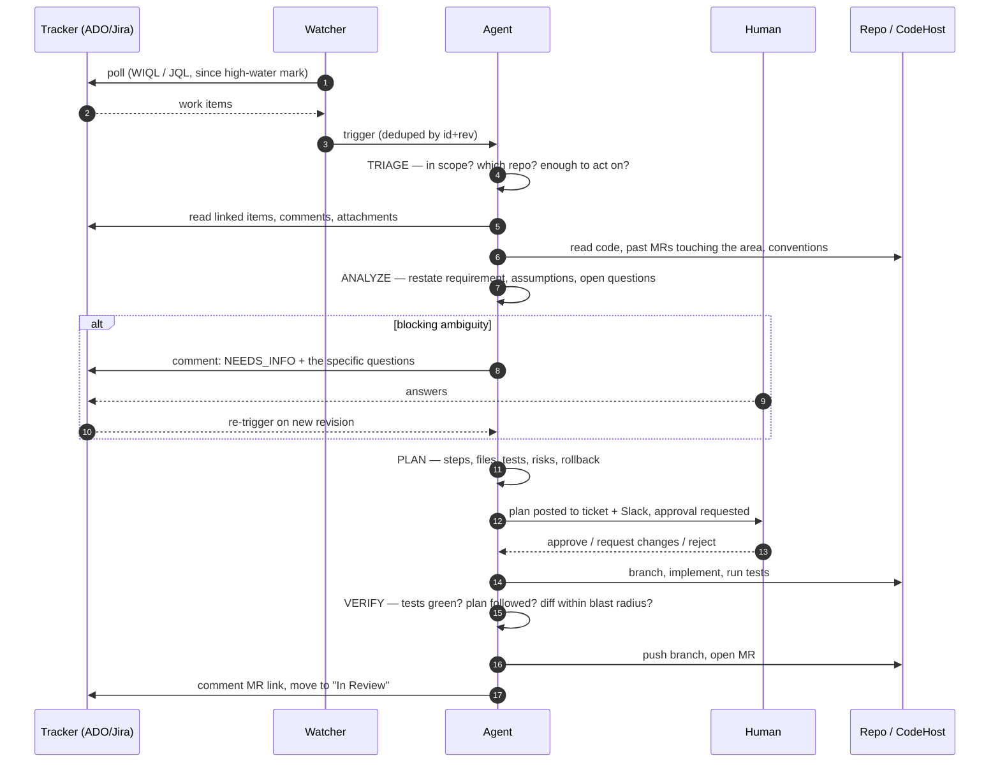

# 02 — Agent: Ticket-to-MR

> Watch Azure DevOps / Jira for new work items → analyse the requirement → propose a plan → get approval → implement → open a merge request.

## End-to-end flow



## Stage 1 — Triage

**Input:** a normalised `WorkItem`.
**Output:** `IN_SCOPE` + a target repository, or `SKIPPED` with a reason.
**Model use:** small, cheap, low effort. This is a classifier, not a thinker.

Deterministic gates run *before* the model, because they are free:

| Gate | Rule |
|---|---|
| Type filter | `config.agents.ticketToMr.workItemTypes`, default `[Bug, User Story, Task]`. Epics and Features are skipped — they decompose, they don't implement. |
| Label filter | Optional required label (`agent-ready`) and a hard denylist (`no-agent`, `security`, `spike`). |
| Assignment | Skip if assigned to a human other than the agent's identity, unless `claimAssigned: false`. |
| Freshness | Skip items whose latest revision is older than the watcher's start time (prevents a backlog stampede on first run). |
| Duplicate | Skip if an open run or open MR already references this work item. |

Then the model answers three questions with a structured output:

1. **Is this actionable as a code change?** Reject "investigate why X is slow" and "schedule a meeting with the vendor". Accept "add a `retryCount` field to the payment request DTO".
2. **Which repository?** Resolved from, in order: an explicit `repo:` field or tag on the ticket → area-path/component → repo mapping in config → the model's inference from the description, which must then match a configured repo or triage fails.
3. **Confidence.** Below `triageConfidenceThreshold` (default 0.6) the run becomes `NEEDS_INFO` rather than guessing.

> **Why a repo must be resolved here:** every later stage needs a checkout to be useful. An agent that analyses a requirement without the code produces a plan that reads well and doesn't apply.

## Stage 2 — Analyze

This is where the run is won or lost. The stage's real job is **retrieval**, and the model call at the end is almost a formality by comparison.

### Evidence bundle

Gathered before the analysis prompt, and persisted on the run so it can be inspected and replayed:

| Source | What is pulled | Why |
|---|---|---|
| The work item | Title, description, acceptance criteria, repro steps, attachments (text-extractable), full comment thread | Comments routinely contain the real requirement; descriptions are often stale. |
| Linked items | Parent story, sibling tasks, "duplicate of", "related to" | The parent usually holds the acceptance criteria the child omits. |
| Repository | `README`, `CONTRIBUTING`, `CLAUDE.md`/`AGENTS.md`, ADRs, the module's own docs | Conventions the agent must follow, stated by the team rather than guessed. |
| Code search | Symbols and strings named in the ticket, grepped across the repo | Locates the actual code under discussion instead of a plausible-looking file. |
| Git history | Recent commits and merged MRs touching the identified files | Shows how this area is normally changed, and who reviews it. |
| Tests | Existing test files near the target code, plus the repo's test command | Determines whether a test-first plan is even possible here. |

Retrieval is agentic — the model drives `Grep`/`Glob`/`Read` under a read-only tool policy — with a hard cap on files read (default 60) and total bytes. Uncapped retrieval is the main way this stage silently becomes expensive.

### Analysis output

Structured, schema-validated:

```jsonc
{
  "restatement": "One paragraph: what the change must accomplish, in the agent's words.",
  "inScopeBehaviour":  ["Explicit list of behaviours that must exist after the change"],
  "outOfScope":        ["Things a reader might assume are included, that are not"],
  "assumptions":       [{ "assumption": "...", "basis": "ticket comment #4", "risk": "low|med|high" }],
  "openQuestions":     [{ "question": "...", "blocking": true, "whyItMatters": "...", "suggestedDefault": "..." }],
  "affectedAreas":     [{ "path": "src/...", "why": "...", "confidence": 0.0 }],
  "existingCoverage":  { "hasTests": true, "testFiles": ["..."], "gap": "..." },
  "risk":              { "level": "low|medium|high", "factors": ["..."] }
}
```

**The `openQuestions` rule.** A question is `blocking: true` only if two reasonable engineers would implement *materially different things* depending on the answer. "Should the button be blue or the theme's primary colour?" is not blocking — pick the convention and record it as an assumption. "Should existing rows be backfilled or left null?" is blocking.

This distinction is the single highest-leverage piece of prompt tuning in the whole system. An agent that asks about everything is ignored; an agent that asks about nothing ships the wrong thing. The prompt states the test explicitly and gives worked examples of both — see [`prompts/requirement-analysis.md`](../prompts/requirement-analysis.md).

If any question is blocking → post them as a ticket comment (numbered, each with why it matters and a suggested default so the human can reply "1: yes, 2: default"), transition to `NEEDS_INFO`, and stop. The next revision of the ticket re-triggers the run, which resumes at Analyze with the new comments in the bundle.

## Stage 3 — Plan

The deliverable a human actually reviews. Optimised for *fast rejection*: a reviewer should be able to tell in 60 seconds whether this is the right change.

```markdown
## Plan: <work item id> — <title>

**Understanding:** <2–3 sentences>
**Approach:** <the chosen approach in 2–3 sentences, and the alternative that was rejected, and why>

### Changes
| # | File | Change | Why |
|---|------|--------|-----|
| 1 | src/payments/RefundService.cs | Add `IdempotencyKey` to `RefundRequest`, thread to repo layer | Requirement 1 |
| 2 | src/payments/RefundRepository.cs | Unique index + conflict handling | Prevents double-refund |

### Tests
- [ ] Unit: duplicate key returns the original refund, no second charge
- [ ] Unit: missing key → 400 with the existing error contract
- [ ] Integration: concurrent identical requests → one refund

### Assumptions
1. Keys are client-generated UUIDs (ticket comment #4)

### Risks & blast radius
- Touches the refund write path — **medium**. Migration required; requires a deploy-order note.
- Files: 4 changed, ~120 lines. No public API break. No config change.

### Out of scope
- Backfilling historical refunds (needs product input — filed as follow-up)

### Rollback
- Revert the MR; migration is additive and safe to leave in place.
```

Plan quality rules enforced in the prompt and checked before posting:

- **Every change row maps to a requirement or an assumption.** Unjustified rows are how scope creep enters.
- **Tests are named as behaviours, not files.** "test the service" is not a test plan.
- **Blast radius is quantified** — file count, line estimate, whether public contracts, DB schema, or config change. This drives the review routing in [06-human-in-the-loop.md](06-human-in-the-loop.md).
- **The rejected alternative is stated.** It is the fastest signal to a reviewer that the agent considered the design space, and the fastest way for them to say "actually do the other one".

The plan is posted to the ticket **and** pushed to Slack/Teams with approve / request-changes / reject actions. The run parks in `AWAITING_APPROVAL`.

## Stage 4 — Approval gate

| Decision | Effect |
|---|---|
| **Approve** | `IMPLEMENTING`. The approved plan text is frozen onto the run and becomes the implementation contract. |
| **Approve with edits** | The human's edited plan replaces the agent's. This is the most common path in practice and the richest training signal — the diff between proposed and approved plan is captured for evaluation. |
| **Request changes** | Back to `PLANNING` with the feedback appended. Bounded to `maxPlanRevisions` (default 2), then it becomes a human's ticket. |
| **Reject** | `REJECTED`, with the reason recorded and posted to the ticket. |
| **No response in TTL** | `EXPIRED`. Analysis stays as a ticket comment. |

In `autonomous` mode this gate auto-approves — but only when *all* of: risk is `low`, blast radius is under the configured threshold, no schema/config/public-API change, and the repo is on the autonomous allowlist. Anything else falls back to human approval regardless of mode. See [08-rollout.md](08-rollout.md).

## Stage 5 — Implement

Runs in a dedicated worktree at `.worktrees/<runId>`, branch `agent/<workItemId>-<slug>`.

The agent is given the frozen plan, the evidence bundle, and write tools. The prompt's operating rules:

1. **Follow the plan.** Any deviation must be reported in the result, not silently absorbed. A deviation that expands scope stops the stage and returns to approval.
2. **Match the surrounding code.** Same naming, same error handling, same test idiom. The evidence bundle exists to make this possible; "write idiomatic C#" is not the instruction — "write code that reads like `RefundService.cs`" is.
3. **Tests first where the repo does that**, otherwise alongside. Never a change without a test that would have caught the bug, for bug tickets.
4. **Commit in logical steps** with messages referencing the work item. A reviewer reading commit-by-commit should see the plan unfold.
5. **No unrelated changes.** No opportunistic reformatting, no dependency bumps, no "while I was here". This is the fastest way to lose reviewer trust.
6. **If it turns out the plan is wrong** — the code doesn't work the way the analysis assumed — stop, don't improvise. Return `PLAN_INVALID` with what was discovered; the run goes back to `PLANNING` with that finding as new evidence.

Rule 6 matters more than it looks. Agents that push through a broken plan generate the diffs that destroy a team's willingness to use them at all.

## Stage 6 — Verify

Self-review before a human is asked to spend attention. Four checks, all recorded:

1. **Build & tests.** The repo's own commands, from config or auto-detected. Failures feed back to Implement, up to `maxFixAttempts` (default 3).
2. **Plan conformance.** Diff versus the approved plan's file list. Extra files are flagged; missing files fail the stage.
3. **Blast radius.** Actual diff stat versus the estimate. A 3× overrun is a hard stop — it means the plan was wrong, not that the code is bad.
4. **Self-review pass.** A fresh agent invocation with *only* the diff and the plan (not the implementation transcript — that biases it), asked to find defects. Anything it finds is fixed before publishing, and the review is attached to the MR so human reviewers can see what was already checked.

The blind self-review is worth its cost. The implementation transcript contains the reasoning that produced the bug; giving the reviewer that reasoning reproduces the blind spot.

## Stage 7 — Publish

- Push branch; open the MR with a description generated from the plan (context → what changed → how it was tested → what to look at closely → what is explicitly not covered).
- **Label it as agent-authored.** Non-negotiable. Reviewers must know.
- Request reviewers from git history on the touched files, and from CODEOWNERS.
- Link both directions: MR references the work item, work item comment carries the MR link.
- Transition the work item if configured (`In Review`), never to `Done`.
- Attach the run id, so anyone can pull the full record.

## Configuration

```yaml
agents:
  ticketToMr:
    enabled: true
    autonomy: propose
    sources: [ado-main]
    workItemTypes: [Bug, "User Story", Task]
    requireLabel: agent-ready
    denyLabels: [no-agent, security, spike]
    triageConfidenceThreshold: 0.6
    maxPlanRevisions: 2
    maxFixAttempts: 3
    approvalTtlHours: 72
    evidence:
      maxFilesRead: 60
      maxBytesRead: 800000
      includeGitHistoryDays: 90
    blastRadius:
      maxFilesChanged: 15
      maxLinesChanged: 600
      hardStopOnOverrunFactor: 3
    repoMapping:
      "Payments\\Core": payments-service
      "Payments\\Web": payments-web
    budgetUsdPerRun: 8
```

## Failure modes and mitigations

| Failure mode | Mitigation |
|---|---|
| Plausible plan for the wrong code | Repo resolution is mandatory at triage; affected areas carry confidence scores; the plan names specific files a reviewer can sanity-check instantly. |
| Asks too many questions, gets ignored | The blocking test is explicit and exemplified; non-blocking items become assumptions with a stated default. |
| Asks nothing, ships the wrong thing | Assumptions are surfaced in the plan with their basis, so a reviewer sees the guesses being made. |
| Scope creep in the diff | Plan conformance check + blast-radius overrun hard stop + "no unrelated changes" rule. |
| Tests written to pass, not to catch bugs | For bug tickets, the test must fail on the pre-fix code — verified by running it against the base commit before applying the fix. |
| Stampede on first run | Freshness gate; global concurrency cap; per-day run cap. |
| Prompt injection via ticket text | Ticket content is untrusted data, delimited and labelled as such. See [05-guardrails.md](05-guardrails.md). |
