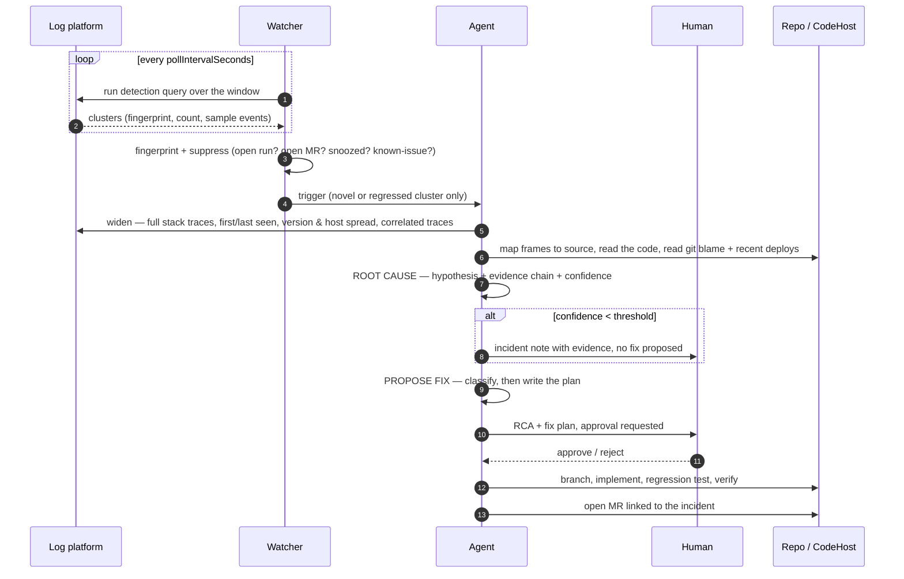

# 03 — Agent: Log-Triage

> Watch Splunk / CloudWatch Logs / Application Insights → detect a real issue → gather evidence → root-cause it → propose a fix → get approval → implement → open a merge request.

The hard part here is not the fix. It is **deciding that there is something to fix**, and **not being wrong about why**.

## End-to-end flow



## Stage 1 — Detect & suppress

Detection lives in **your query**, not in the agent. Each configured log source carries a detection query that returns clusters. The agent's job starts at "here is a cluster"; putting anomaly detection inside the model is slow, expensive, and worse than the query you already trust.

Three detection modes ship as query templates:

| Mode | Query returns | Good for |
|---|---|---|
| `new-fingerprint` | Exception signatures not seen in the previous N days | Regressions introduced by a deploy |
| `rate-threshold` | Signatures whose count in the window exceeds an absolute or relative threshold | Known-but-worsening errors |
| `slo-burn` | Endpoints whose error rate or p99 breaches a target | Slow degradations that never throw |

### Fingerprinting

Raw log lines never dedupe — they contain ids, timestamps, and user data. The normalised fingerprint is:

```
sha256(
  exceptionType +
  normalise(message)  +          // GUIDs, numbers, emails, paths, URLs → placeholders
  topNAppFrames(stack, 5)        // frames from your namespaces only, framework frames dropped
)
```

The stack-frame component is what makes this work: the same `NullReferenceException` thrown from two different code paths is two problems, and the same problem logged with two different messages is one.

### Suppression

A signal does **not** create a run when any of these hold:

- An open run exists for the fingerprint.
- An open MR references the fingerprint.
- The fingerprint is in the known-issues list (with an expiry, so entries do not become permanent).
- It is snoozed (`snoozeUntil` set by a human reacting to the notification).
- Global rate limit reached — `maxNewRunsPerHour`, default 3.

The rate limit exists because outages produce correlated errors across dozens of fingerprints. Without it, the agent's first real incident is also the incident where it opens thirty MRs. During a declared incident, the whole agent should be paused; the kill switch is in [09-operations.md](09-operations.md).

## Stage 2 — Gather evidence

The detection query returns a summary. This stage widens it into something a human debugger would recognise as "the evidence".

| Dimension | Pulled | Why it matters |
|---|---|---|
| **Samples** | 5–10 full events with complete stack traces, spread across the window | One sample is an anecdote; the spread tells you if it is one input or a class of inputs |
| **Timeline** | First seen, last seen, count over time, whether it is rising | Distinguishes "new" from "always been there, just noticed" |
| **Blast** | Distinct users / tenants / requests affected; % of traffic on that path | Drives severity, and whether this is worth an MR at all |
| **Spread** | Hosts, regions, instances, app versions affected | All on one host → infrastructure. All on one version → deploy. Everywhere → code path. |
| **Correlation** | Deploys, config changes, feature-flag flips in the window | The single most predictive signal, and the one an agent can actually fetch |
| **Upstream/downstream** | Errors in dependencies at the same timestamps; distributed traces if available | Separates "we have a bug" from "our dependency is down" |
| **Preceding events** | Log lines from the same request/trace before the error | Where the actual cause usually is |

Then the code side:

| Step | Detail |
|---|---|
| **Frame → source mapping** | Map stack frames to files and lines, accounting for build config. Wrong here means everything downstream is fiction, so a frame that cannot be mapped is reported rather than guessed at. |
| **Read the code** | The failing function, its callers, its callees. |
| **`git blame` + history** | When did these lines last change, in what MR, for what ticket? |
| **Deploy correlation** | Which commit range went out immediately before first-seen? |
| **Existing tests** | Does a test cover this path? If yes, why did it pass? That answer is often the actual finding. |

## Stage 3 — Root cause

Structured, evidence-linked, and explicitly falsifiable:

```jsonc
{
  "hypothesis": "RefundService.ProcessAsync dereferences payment.Metadata without a null check; metadata is null for refunds created by the v2 import path added in #4412.",
  "evidenceChain": [
    { "claim": "Throws at RefundService.cs:142", "evidence": "stack frame, 47/47 samples" },
    { "claim": "Line 142 reads payment.Metadata.TryGetValue", "evidence": "source read at HEAD" },
    { "claim": "Metadata is nullable and unset on the import path", "evidence": "PaymentImporter.cs:88 constructs without Metadata" },
    { "claim": "First seen 2026-08-14T09:12Z, 6 minutes after deploy of #4412", "evidence": "deploy timeline correlation" }
  ],
  "confidence": 0.86,
  "alternativeHypotheses": [
    { "hypothesis": "Concurrent mutation clears Metadata", "whyLessLikely": "single-threaded per request; no writers found" }
  ],
  "category": "null-dereference",
  "severity": "high",
  "reproduction": "Call POST /refunds with a payment created via the import path.",
  "whyTestsMissedIt": "Integration tests construct payments through the API path only; the import path has no test fixture.",
  "notACodeIssue": false
}
```

Requirements the prompt enforces:

- **Every claim carries its evidence.** A hypothesis with no chain is rejected by schema validation, not by taste.
- **At least one alternative** must be stated and argued against. This is the cheapest available defence against the model's tendency to commit to its first idea.
- **`whyTestsMissedIt` is mandatory.** It is what makes the fix include the right regression test instead of a test that mirrors the fix.
- **`notACodeIssue: true` is a first-class success.** Dependency outage, expired certificate, exhausted disk, upstream rate-limit — the agent writes the incident note and stops. Agents that must produce a diff will produce a diff.

Below `rcaConfidenceThreshold` (default 0.7): no fix is proposed. The evidence bundle and the ranked hypotheses are posted as an incident note. A human gets a 10-minute head start on their investigation, which is most of the value even when the agent cannot close it.

## Stage 4 — Propose fix

Classification comes first, because it determines whether an MR is even the right output:

| Class | Fix shape | Auto-proposable? |
|---|---|---|
| **Defensive** (missing null/bounds/empty check) | Add the guard *and* fix the caller that produced the invalid state | Yes — but the guard alone is treated as incomplete |
| **Contract** (API/schema mismatch, bad deserialization) | Correct the contract or add explicit validation at the boundary | Yes |
| **Concurrency** (race, deadlock, non-atomic read-modify-write) | Proposed with reduced confidence and always human-approved | Flagged — never auto |
| **Resource** (leak, pool exhaustion, unbounded growth) | Fix the lifecycle, add a bound | Flagged |
| **Config / environment** | No code fix — an incident note with the recommended change | No |
| **Dependency failure** | No code fix — unless the finding is a missing timeout/retry/circuit-breaker, which *is* a code fix | Conditional |
| **Expected error, logged wrongly** | Change the log level or add handling; adjust the detection query | Yes, low risk |

That last row is worth a mention: a meaningful share of "production errors" are expected conditions logged at `Error`. Fixing the *logging* is a real and valuable output, and an agent that cannot produce it will instead invent a code bug.

The fix plan then follows the same structure as [Ticket-to-MR's plan](02-agent-ticket-to-mr.md#stage-3--plan), with two additions:

- **A regression test that fails on the current code.** Mandatory. It is verified by running it against the pre-fix commit — if it passes there, the stage fails, because a test that does not reproduce the bug does not prove the fix.
- **A monitoring note** — what should be watched after deploy to confirm the fix, expressed as the concrete query.

## Stages 5–7 — Approval, implement, verify, publish

Identical to Ticket-to-MR, with these deltas:

- The MR description leads with the incident: fingerprint, occurrence count, affected users, first seen, correlated deploy.
- The MR is linked to the incident/work item if one was auto-filed.
- Severity drives review routing: `high`/`critical` requests the service owner directly rather than round-robin.
- After merge (detected on a later poll), the fingerprint enters a **watch list**: if it reappears within `verificationWindowHours` (default 48), the agent reopens with `FIX_INEFFECTIVE` and links the original MR. Confirming that a fix worked is part of the job.

## Configuration

```yaml
agents:
  logTriage:
    enabled: true
    autonomy: comment
    sources: [appinsights-prod, cw-orders]
    detection:
      mode: new-fingerprint
      windowMinutes: 15
      minOccurrences: 25
      minAffectedUsers: 3
      lookbackDaysForNovelty: 7
    suppression:
      maxNewRunsPerHour: 3
      knownIssues:
        - fingerprint: "a3f9c1..."
          reason: "Upstream vendor issue, ticket VEN-9921"
          expires: 2026-09-30
    rcaConfidenceThreshold: 0.7
    fixClasses:
      autoPropose: [defensive, contract, logging]
      flagOnly:    [concurrency, resource]
      neverPropose:[config, dependency]
    verificationWindowHours: 48
    serviceRepoMapping:
      payments-api: payments-service
      orders-worker: orders-service
    budgetUsdPerRun: 10
```

## Failure modes and mitigations

| Failure mode | Mitigation |
|---|---|
| **Confident wrong RCA** | Mandatory evidence chain; mandatory alternative hypothesis; confidence threshold; the human sees the chain, not just the conclusion. |
| **MR storm during an outage** | Per-hour run cap, fingerprint suppression, open-MR check, and a global kill switch. |
| **Treats a symptom, not the cause** | Defensive fixes must also address the source of the invalid state; the plan states which is which. |
| **Regression test that doesn't regress** | Test is executed against the pre-fix commit and must fail there. |
| **Log noise treated as a bug** | The "expected error, logged wrongly" class is explicitly available, and detection thresholds require both a count and an affected-user floor. |
| **Chasing an infrastructure problem into the code** | Spread analysis (one host / one region / one version) and the `notACodeIssue` output path. |
| **PII from logs leaking into tickets and prompts** | Redaction at the connector boundary before storage or model call — see [05-guardrails.md](05-guardrails.md). |
| **Fix merged, error continues** | Post-merge watch window reopens the run rather than declaring victory. |
